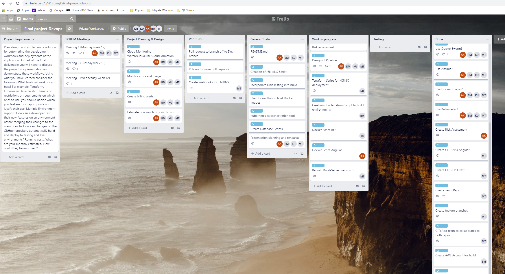
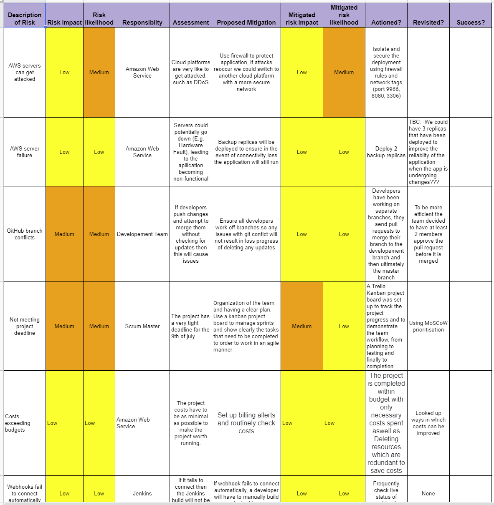

# Team 1 - QA Final Group Project Repo

## Team Members:
* Arman Khan
* Beatriz Manzano
* Kazi Uddin
* Martin Taylor

## Background
The team's brief was to:
1. Review the design and requirements for the PetClinic applicatrion.
2. Select the appropriate tools and application to automate both test and production installation.
3. Create a full CD/CI deployment

## The Application:
PetClinic WebApp has three components
1. A front-end written in angular js 
2. A back-end restful API version of the written in java (Link). 
3. A database connected to the back-end, running on MySQL.

## Build Server:
A single AWS instance running the following applications:
* Jenkins for CD/CI automation
* Ansible for instance configure
* Docker for containerisation
* Kubenetes to Deploy instances to the Evironments
* Terraform to build Environments

## Project Management:
The team review the choice of available software to manage the project and descided on TRELLO. Since the begin of the project, the appointed Scrum Master has been hosting dialy meetings a 9am, recording the minutes within the TRELLO board.

## Risk Assessment:
The team conducted a simple risk assessment:

